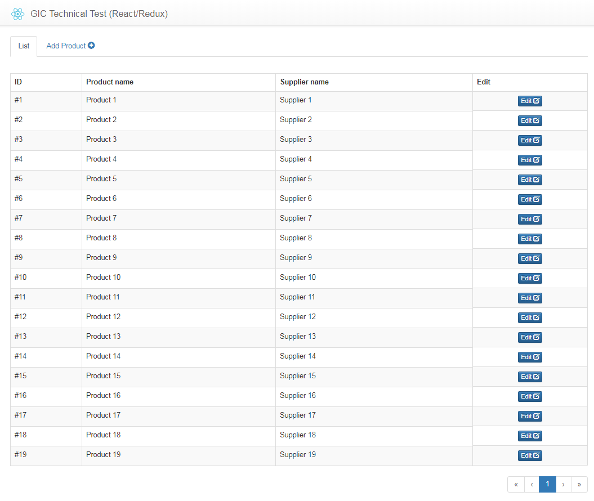

# 1. Overview

This repository contains a set of reactJS technical tests for interview candidates. 

The test only covers front-end development, and does not require a backend.
It covers the basics of the following: 

- react
- react-router
- react-bootstrap
- redux
- redux-forms
- sagas

# 2. Test questions (PDF)

[React-Test-questions.pdf](react-techtest/React-Test-questions.pdf)

# 3. How to use?

Brief instructions to use this.

### Step 1: Git clone this repository.

`
git clone https://git/PrivateMarket/TechnicalTest-React
`

### Step 2: Run (or double-click) reset-test.bat

This will create a clean copy of the test on `Desktop\GIC-React-Test` (for windows).
It will include the pdf copy of the test questions.

### Step 3: Start the program

- Install node-modules: `npm install`
- Run the app: `npm start`

View the website locally on http://localhost:8080/

# 4. Screen shot of the application

# 5. License & Credits

GIC. Don't play-play.

-- Team CRM.
